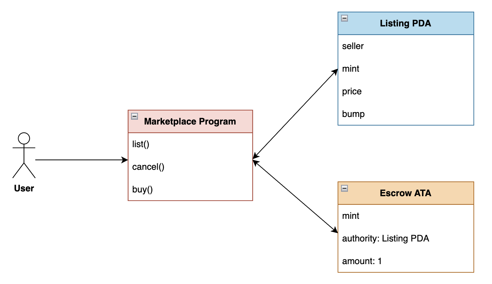
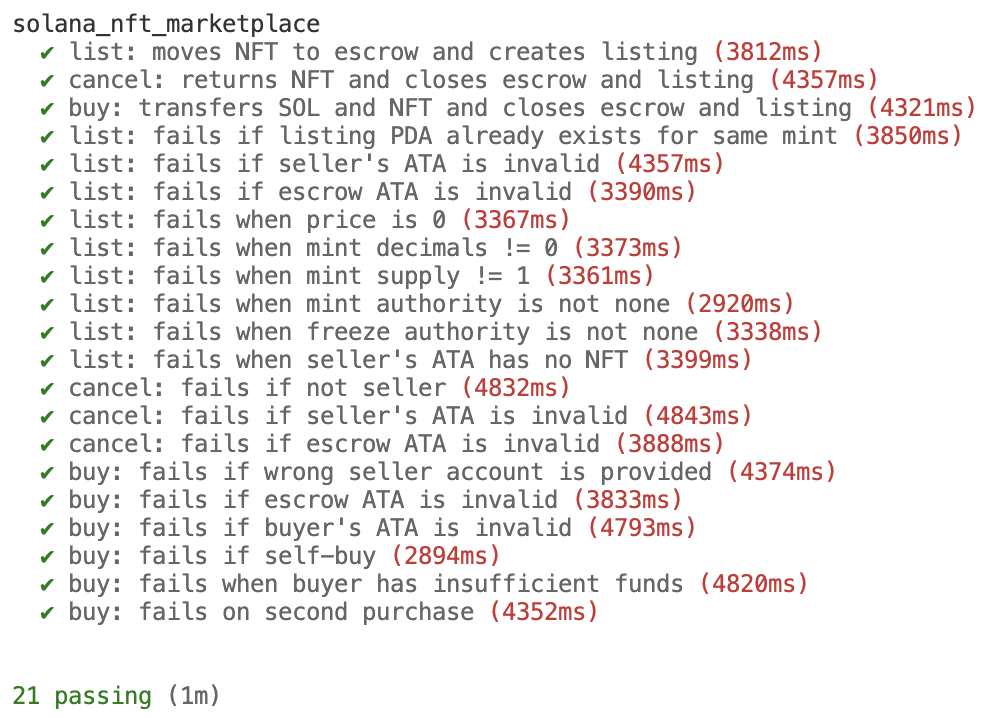

<h1 align="center">Solana NFT Marketplace</h1>

<p align="center">
  <a href="https://github.com/hieutrinh02/solana-nft-marketplace/blob/main/LICENSE">
    
  </a>
  
  
  
</p>

## ✨ Overview

This repository contains a minimal NFT marketplace implementation on Solana using Anchor. The goal of this project is to explore:

- Program Derived Addresses (PDAs)
- Associated Token Accounts (ATA)
- SPL token interactions
- Secure escrow design
- Constraint-based validation in Anchor

The focus of this project is smart contract correctness, safety, and clean account design.

## 📄 High-level protocol design

<p align="center">
  
</p>

### Design highlights

- **Marketplace Program**: User-facing entry point for listing, canceling, and buying NFTs.
- **Listing PDA**: Stores listing metadata (seller, mint, price, bump). One listing per mint.
- **Escrow ATA**: Associated Token Account controlled by the Listing PDA. Holds exactly 1 NFT during listing.
- **SPL Token Program**: Handles NFT transfers.
- **System Program**: Handles SOL transfers.

## 🚀 Features

- **List**
  - Transfers NFT from seller to escrow ATA.
  - Creates a Listing PDA storing price and ownership info.
  - Validates NFT properties (decimals = 0, supply = 1, no mint/freeze authority).

- **Cancel**
  - Only seller can cancel.
  - Transfers NFT back to seller.
  - Closes escrow ATA and Listing account.

- **Buy**
  - Transfers SOL from buyer to seller.
  - Transfers NFT from escrow to buyer.
  - Closes escrow ATA and Listing account.
  - Prevents self-buy.

## 🔐 Security Design

### NFT Validation

When listing, the program enforces:

- `mint.decimals == 0`
- `mint.supply == 1`
- `mint_authority == None`
- `freeze_authority == None`
- Seller ATA must hold exactly 1 token

This ensures only immutable 1-of-1 NFTs can be listed.

### Escrow Safety

- Escrow ATA is derived as:
  
  `ATA(mint, listing PDA)`

- Only the Listing PDA can sign for escrow transfers.
- `init_if_needed` prevents DoS via pre-created ATA.
- Escrow ATA is closed after cancel/buy.

### Account Constraints

Anchor constraints enforce:

- PDA seed validation
- `has_one` relationships
- Associated token account correctness
- Ownership correctness
- Self-buy prevention

## 🧪 Test Coverage

The codebase includes:

- Happy path tests (list / cancel / buy)
- Constraint violation tests
- NFT validation tests
- Escrow misuse tests
- Self-buy protection test
- Double-buy prevention test

Total: **21 test cases**

<p align="center">
  
</p>

## 🧰 Tech Stack

- Blockchain: Solana
- Framework: Anchor
- Language: Rust
- Token standard: SPL Token
- Testing: Mocha + TypeScript

## 🛠 Installation & Testing

Prerequisites

- Solana CLI 3.1.7
- Anchor CLI 0.32.1
- Node.js 24.10.0

Clone the repo and from within the project's root folder run:

```bash
yarn install
```

Run tests

```bash
anchor test
```

## ⚠️ Disclaimer

This code is for educational purposes only, has not been audited,
and is provided without any warranties or guarantees.

## 📜 License

This project is licensed under the MIT License.