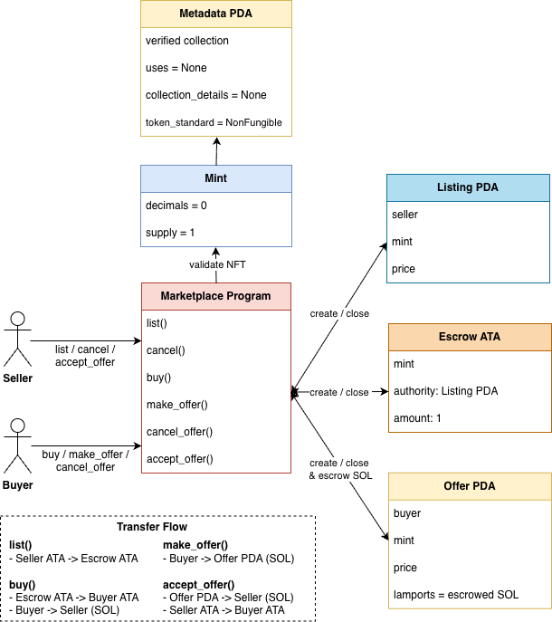

<h1 align="center">Solana NFT Marketplace Program</h1>

<p align="center">
  <a href="https://github.com/hieutrinh02/solana-nft-marketplace-program/blob/main/LICENSE">
    
  </a>
  
  
  
</p>

## ✨ Overview

This repository contains the on-chain program for an NFT marketplace on Solana, built with Anchor.

The goal of this project is to explore:

- PDA-based marketplace state design
- ATA-based NFT escrow for fixed-price listings
- SOL escrow in PDA lamports for offers
- SPL token interactions
- Metaplex Token Metadata validation
- Strict NFT policy enforcement for cleaner protocol semantics

The focus of this project is program correctness, safety, and a clean on-chain core.

## 🌐 Deployed Program

Devnet

- Program ID: `FnZUe7Vwefyr7wiyP4qR6rHYiANAcsHYLH4aVYXwVdzh`
- Explorer: https://solscan.io/account/FnZUe7Vwefyr7wiyP4qR6rHYiANAcsHYLH4aVYXwVdzh?cluster=devnet

## 📄 High-level protocol design

<p align="center">
  
</p>

### Design highlights

- **Marketplace Program**: Entry point that coordinates listing flow, offer flow, NFT validation, and account lifecycle.
- **Listing PDA**: Canonical state for a fixed-price listing, storing the seller, mint, and asking price.
- **Escrow ATA**: PDA-owned token account that holds the NFT while a listing is active.
- **Offer PDA**: Buyer-scoped offer state that also escrows SOL directly in PDA lamports.
- **Mint + Metadata PDA**: Shared validation layer used to enforce the marketplace NFT policy.

## 🚀 Features

- **list**
  - Validates NFT metadata through Metaplex Token Metadata.
  - Creates the listing PDA.
  - Moves the NFT from the seller ATA into the escrow ATA owned by the listing PDA.

- **cancel**
  - Restricts cancellation to the listing seller.
  - Returns the NFT from escrow to the seller.
  - Closes the escrow ATA and listing PDA.

- **buy**
  - Prevents self-buy.
  - Transfers SOL from buyer to seller.
  - Transfers the NFT from escrow ATA to buyer ATA.
  - Closes the escrow ATA and listing PDA.

- **make_offer**
  - Validates NFT metadata through Metaplex Token Metadata.
  - Creates the offer PDA.
  - Escrows SOL directly in the offer PDA lamports balance.

- **cancel_offer**
  - Restricts cancellation to the buyer who created the offer.
  - Refunds SOL from the offer PDA back to the buyer.
  - Closes the offer PDA.

- **accept_offer**
  - Prevents self-accept.
  - Transfers the NFT from seller ATA to buyer ATA.
  - Releases SOL from the offer PDA to the seller.
  - Closes the offer PDA.

## 🔐 NFT Policy

The current program intentionally supports a narrow NFT surface:

- Metaplex Token Metadata only
- regular NFTs only
- verified collection required
- `TokenStandard::NonFungible` only
- `uses == None`
- collection NFTs are not supported
- editions are not supported
- creator royalties are not enforced

## 🛡️ Security Defenses

The current implementation includes the following defensive checks and hardening measures:

- Metaplex ownership validation: metadata accounts must be owned by the Metaplex Token Metadata program.
- Metadata PDA validation: metadata PDA must match the provided mint.
- NFT shape validation: the mint must satisfy `decimals == 0` and `supply == 1`.
- Collection validation: the NFT must belong to a verified collection.
- Collection NFT rejection: `collection_details` must be `None`, which excludes collection NFTs.
- Usage restriction: `uses` must be `None`.
- Token standard restriction: `token_standard` must be `NonFungible`.
- PDA linkage validation: listing and offer state are constrained through Anchor PDA seeds and `has_one` relationships.
- ATA correctness validation: escrow and user token accounts are checked through `associated_token::*` constraints.
- Escrow separation: fixed-price listings escrow NFTs in a PDA-owned ATA, while offers escrow SOL in PDA lamports.
- Negative-path tests: the suite covers invalid authority, invalid mint, invalid escrow accounts, invalid token accounts, and other failures.

## 🧪 Test Coverage

The codebase includes:

- Happy path tests for `list`, `cancel`, and `buy`
- Happy path tests for `make_offer`, `cancel_offer`, and `accept_offer`
- Negative-path tests for the full trade flow
- Negative-path tests for the full offer flow

Total: **40 test cases**

## 🧰 Tech Stack

- Blockchain: Solana
- Framework: Anchor
- Language: Rust
- Token standard: SPL Token
- NFT metadata stack: Metaplex Token Metadata
- Test suite: TypeScript + Mocha
- NFT creation scripts: TypeScript + Umi

## 🛠 Build, Test & Deploy

Prerequisites

- Solana CLI
- Anchor CLI
- Node.js
- Yarn

Install dependencies:

```bash
yarn install
```

Build the program:

```bash
anchor build
```

Run tests:

```bash
anchor test
```

Deploy to devnet:

Update `cluster` under `[provider]` in `Anchor.toml` to `devnet`

```bash
anchor keys sync
anchor build
anchor deploy
```

Inspect the deployed program id:

```bash
solana address -k target/deploy/solana_nft_marketplace_program-keypair.json
solana program show <PROGRAM_ID>
```

## ⚠️ Disclaimer

This code is for educational purposes only, has not been audited, and is provided without any warranties or guarantees.

## 📜 License

This project is licensed under the MIT License.
